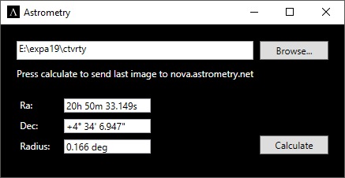

# What is astrometry?
A desktop tool using nova.astrometry.net API to process a sky pictures (JPEG, GIF, PNG, or FITS image) and calculate astrometry. The result is shown in the desktop tool. 
#### Typical usecase 
 1 - The user selects a folder where pictures a CCD camera (or any camera) are being saved. 
 2 - Everytime the user wants to check the exact field that is being captured, he can do so with a single click on the button Calculate. 
 3 - The tool uses the latest file in the folder and the result is available within minutes according to the queue on nova.astrometry.net. 

# Completed  
 1 - Comunicate with nova.astrometry.net using API ✅ 
 2 - User Interface ✅ 
 3 - Check status of the job periodically ✅ 
 4 - Show results in UI ✅ 
 5 - Ask for and show the rest of the available information. 🔲 
